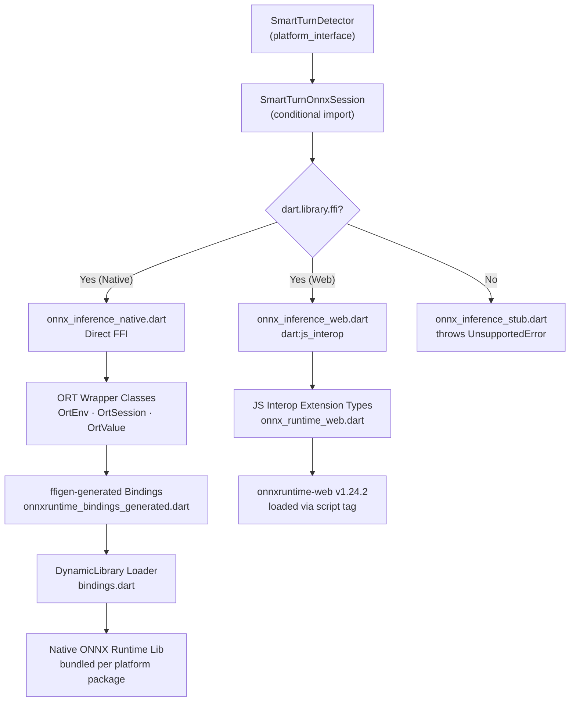

# Migrate `pipecat_smart_turn` to Direct FFI Bindings for Full-Feature Parity

## Background

The `pipecat_smart_turn` package currently uses the [`onnxruntime`](https://pub.dev/packages/onnxruntime) pub package (v1.3.1) for native ONNX inference and `dart:js_interop` for web. The [`vad`](file:///home/limcheekin/dev/ws/flutter/pipecat_smart_turn/vad) package demonstrates a superior pattern: **direct FFI bindings** to the ONNX Runtime C API via `ffigen` for native platforms, and `dart:js_interop` extension types for web.

This plan migrates `pipecat_smart_turn` to that same architecture, enabling:
- **Full control** over ONNX Runtime version (targeting v1.24.2)
- **No dependency** on the `onnxruntime` pub package
- **Feature parity** across all platforms using the bundled `smart-turn-v3.2-cpu.onnx` model
- **Consistent architecture** with the VAD package in this monorepo

---

## User Review Required

> [!IMPORTANT]
> **ONNX Runtime v1.24.2 native binaries are required.** Each native platform package must bundle the appropriate shared library. Options per platform:
> - **Android**: Maven dependency `com.microsoft.onnxruntime:onnxruntime-android:1.24.2`
> - **iOS/macOS**: CocoaPods dependency `onnxruntime-objc 1.24.2`
> - **Linux**: Prebuilt `libonnxruntime.so.1.24.2` (x64/arm64) — download from [GitHub Releases](https://github.com/microsoft/onnxruntime/releases/tag/v1.24.2)
> - **Windows**: Prebuilt `onnxruntime.dll` (x64/arm64) — download from [GitHub Releases](https://github.com/microsoft/onnxruntime/releases/tag/v1.24.2)
>
> For Linux/Windows, prebuilt binaries must be committed to the repo (as VAD does). Please confirm this approach is acceptable.

> [!WARNING]
> **Breaking change for direct `onnxruntime` package users**: Removing the `onnxruntime` pub package means any code that imports it directly via `platform_interface` will break. However, the public API (`SmartTurnOnnxSession`, `SmartTurnDetector`) remains **unchanged**.

---

## Proposed Changes

### Phase 1: ONNX Runtime C API Headers & FFI Bindings

Copy the ONNX Runtime v1.24.2 C API header and generate Dart bindings via `ffigen`.

#### [NEW] `pipecat_smart_turn_platform_interface/src/onnxruntime/onnxruntime_c_api.h`

- ONNX Runtime v1.24.2 C API header from [official release](https://github.com/microsoft/onnxruntime/blob/v1.24.2/include/onnxruntime/core/session/onnxruntime_c_api.h)
- Only file in `src/onnxruntime/` — serves as the single input for `ffigen`

#### [NEW] `pipecat_smart_turn_platform_interface/ffigen.yaml`

Configuration to generate FFI bindings from the C API header:
- Input: `src/onnxruntime/onnxruntime_c_api.h`
- Output: `lib/src/platform/native/bindings/onnxruntime_bindings_generated.dart`

#### [NEW] `lib/src/platform/native/bindings/onnxruntime_bindings_generated.dart`

Auto-generated by running: `dart run ffigen --config ffigen.yaml`

---

### Phase 2: Native ORT Wrapper Classes

Create Dart wrappers over the generated FFI bindings, adapted from the VAD package with simplifications for the Smart Turn use case (single-input/single-output model, no recurrent state).

#### [NEW] `lib/src/platform/native/bindings/bindings.dart`

Platform-specific `DynamicLibrary` loader. Adapted from VAD's [bindings.dart](file:///home/limcheekin/dev/ws/flutter/pipecat_smart_turn/vad/lib/src/platform/native/bindings/bindings.dart):

| Platform | Library |
|----------|---------|
| Android | `DynamicLibrary.open('libonnxruntime.so')` |
| iOS | `DynamicLibrary.process()` |
| macOS | `DynamicLibrary.process()` |
| Windows | `DynamicLibrary.open('onnxruntime.dll')` |
| Linux | `DynamicLibrary.open('libonnxruntime.so.1.24.2')` |

#### [NEW] `lib/src/platform/native/onnxruntime/ort_env.dart`

Singleton ONNX Runtime environment. Adapted from VAD's [ort_env.dart](file:///home/limcheekin/dev/ws/flutter/pipecat_smart_turn/vad/lib/src/platform/native/onnxruntime/ort_env.dart):
- `OrtEnv` singleton with lazy initialization via `OrtGetApiBase()` FFI call
- `OrtAllocator` singleton for memory management
- `OrtLoggingLevel` enum

> [!NOTE]
> The `OrtEnv` singleton uses lazy initialization (`init()` called on first access), which is safe for the `compute()` isolate pattern in `SmartTurnIsolate` — each isolate gets its own instance.

#### [NEW] `lib/src/platform/native/onnxruntime/ort_session.dart`

ONNX Runtime session management. Adapted from VAD's [ort_session.dart](file:///home/limcheekin/dev/ws/flutter/pipecat_smart_turn/vad/lib/src/platform/native/onnxruntime/ort_session.dart):
- `OrtSession.fromBuffer(Uint8List, OrtSessionOptions)` — creates session from model bytes
- `OrtSession.run(OrtRunOptions, Map<String, OrtValue>)` — synchronous inference
- `OrtSessionOptions` — `setIntraOpNumThreads()`, `setInterOpNumThreads()`, `setSessionGraphOptimizationLevel()`
- `OrtRunOptions` — run-level configuration
- `GraphOptimizationLevel` enum

> [!IMPORTANT]
> **Key difference from VAD**: The current native code uses `OrtSession.fromFile()` (from the `onnxruntime` package). The VAD only implements `fromBuffer()`. For Smart Turn, we'll read the file bytes ourselves and use `fromBuffer()`, which is what the current code already does indirectly (the `onnxruntime` package's `fromFile()` reads bytes internally). The `SmartTurnDetector.initialize()` already extracts the model to a file path, but `File(path).readAsBytesSync()` is trivial.

#### [NEW] `lib/src/platform/native/onnxruntime/ort_value.dart`

Tensor data marshalling. Adapted from VAD's [ort_value.dart](file:///home/limcheekin/dev/ws/flutter/pipecat_smart_turn/vad/lib/src/platform/native/onnxruntime/ort_value.dart):
- `OrtValueTensor.createTensorWithDataList(List, List<int> shape)` — creates Float32/Int64 input tensors
- `OrtValueTensor.value` getter — extracts output data as nested Dart lists
- Memory lifecycle management (`release()`)

#### [NEW] `lib/src/platform/native/onnxruntime/ort_status.dart`

Error handling. Adapted from VAD's [ort_status.dart](file:///home/limcheekin/dev/ws/flutter/pipecat_smart_turn/vad/lib/src/platform/native/onnxruntime/ort_status.dart):
- `OrtStatus.checkOrtStatus(OrtStatusPtr)` — checks for errors, throws with message
- Error code enum

#### [NEW] `lib/src/platform/native/utils/list_shape_extension.dart`

List utility extension from VAD's [list_shape_extension.dart](file:///home/limcheekin/dev/ws/flutter/pipecat_smart_turn/vad/lib/src/platform/native/utils/list_shape_extension.dart):
- `List.shape` — infers tensor shape from nested lists
- `List.flatten<T>()` — flattens nested lists
- `List.reshape<T>(shape)` — reshapes flat data to nested lists
- `List.element()` — detects element type for typed lists

Required by `OrtValueTensor` for tensor data marshalling.

---

### Phase 3: Rewrite `onnx_inference_native.dart`

#### [MODIFY] [onnx_inference_native.dart](file:///home/limcheekin/dev/ws/flutter/pipecat_smart_turn/pipecat_smart_turn_platform_interface/lib/src/onnx_inference_native.dart)

Replace `package:onnxruntime` import with direct FFI wrappers. The `SmartTurnOnnxSession` public API stays **identical** — only internal implementation changes:

```diff
-import 'package:onnxruntime/onnxruntime.dart';
+import 'dart:io';
+import 'package:pipecat_smart_turn_platform_interface/src/platform/native/onnxruntime/ort_env.dart';
+import 'package:pipecat_smart_turn_platform_interface/src/platform/native/onnxruntime/ort_session.dart';
+import 'package:pipecat_smart_turn_platform_interface/src/platform/native/onnxruntime/ort_value.dart';
```

| Method | Current (onnxruntime package) | New (Direct FFI) |
|--------|-----|-----|
| `initialize()` | `OrtEnv.instance.init()` + `OrtSession.fromFile(File, options)` | `OrtEnv.instance.init()` + `File.readAsBytesSync()` + `OrtSession.fromBuffer(bytes, options)` |
| `run()` | `OrtValueTensor.createTensorWithDataList()` + `session.run()` | Same API names, different underlying FFI types |
| `dispose()` | `session.release()` + `OrtEnv.instance.release()` | Same pattern |

> [!NOTE]
> The `onnx_inference.dart` conditional import barrel file uses `dart.library.ffi` as the guard for native. This is correct — both the VAD (`dart.library.io`) and pipecat (`dart.library.ffi`) guards work for distinguishing native from web. The existing guard is fine and **does not need to change**.

---

### Phase 4: Native Library Bundling per Platform Package

The native ONNX Runtime libraries must be bundled by each platform package so they're available at runtime for the FFI `DynamicLibrary.open()` calls. The platform packages remain standard Flutter plugins (NOT `ffiPlugin`) — they just need their native build configs updated to include ONNX Runtime.

> [!IMPORTANT]
> The platform packages' Dart code (`PipecatSmartTurnAndroid`, `PipecatSmartTurnIOS`, etc.) does **not** change. They still implement `PipecatSmartTurnPlatform` with `getPlatformName()`. The ONNX inference code lives in `platform_interface` and uses FFI to call into the native library that the platform package bundles.

#### Android — [MODIFY] [build.gradle.kts or equivalent](file:///home/limcheekin/dev/ws/flutter/pipecat_smart_turn/pipecat_smart_turn_android/android)

Add Maven dependency to the Android build:
```kotlin
dependencies {
    implementation("com.microsoft.onnxruntime:onnxruntime-android:1.24.2")
}
```

This provides `libonnxruntime.so` for arm64-v8a, armeabi-v7a, x86, and x86_64.

#### iOS — [MODIFY] [pipecat_smart_turn_ios.podspec](file:///home/limcheekin/dev/ws/flutter/pipecat_smart_turn/pipecat_smart_turn_ios/ios/pipecat_smart_turn_ios.podspec)

Add CocoaPods dependency:
```diff
+  s.dependency 'onnxruntime-objc', '1.24.2'
+  s.static_framework = true
```

#### macOS — [MODIFY] [pipecat_smart_turn_macos.podspec](file:///home/limcheekin/dev/ws/flutter/pipecat_smart_turn/pipecat_smart_turn_macos/macos/pipecat_smart_turn_macos.podspec)

Add CocoaPods dependency:
```diff
+  s.dependency 'onnxruntime-objc', '1.24.2'
+  s.static_framework = true
```

#### Linux — [MODIFY] [CMakeLists.txt](file:///home/limcheekin/dev/ws/flutter/pipecat_smart_turn/pipecat_smart_turn_linux/linux/CMakeLists.txt) + [NEW] prebuilt libs

Add bundled library paths per the VAD pattern:
```cmake
set(X64_LIB_PATH "${CMAKE_CURRENT_SOURCE_DIR}/x64/libonnxruntime.so.1.24.2")
set(ARM64_LIB_PATH "${CMAKE_CURRENT_SOURCE_DIR}/arm64/libonnxruntime.so.1.24.2")

# Collect available libraries
set(BUNDLED_LIBS)
if(EXISTS "${X64_LIB_PATH}")
  list(APPEND BUNDLED_LIBS "${X64_LIB_PATH}")
endif()
if(EXISTS "${ARM64_LIB_PATH}")
  list(APPEND BUNDLED_LIBS "${ARM64_LIB_PATH}")
endif()

set(pipecat_smart_turn_linux_bundled_libraries
  ${BUNDLED_LIBS}
  PARENT_SCOPE
)
```

Download prebuilt libs from ONNX Runtime GitHub releases and place in:
- `linux/x64/libonnxruntime.so.1.24.2`
- `linux/arm64/libonnxruntime.so.1.24.2` (if arm64 support needed)

#### Windows — [MODIFY] [CMakeLists.txt](file:///home/limcheekin/dev/ws/flutter/pipecat_smart_turn/pipecat_smart_turn_windows/windows/CMakeLists.txt) + [NEW] prebuilt libs

Add bundled library paths:
```cmake
set(X64_LIB_PATH "${CMAKE_CURRENT_SOURCE_DIR}/x64/onnxruntime.dll")
set(ARM64_LIB_PATH "${CMAKE_CURRENT_SOURCE_DIR}/arm64/onnxruntime.dll")

set(BUNDLED_LIBS)
if(EXISTS "${X64_LIB_PATH}")
  list(APPEND BUNDLED_LIBS "${X64_LIB_PATH}")
endif()
if(EXISTS "${ARM64_LIB_PATH}")
  list(APPEND BUNDLED_LIBS "${ARM64_LIB_PATH}")
endif()

set(pipecat_smart_turn_bundled_libraries
  ${BUNDLED_LIBS}
  PARENT_SCOPE
)
```

Download prebuilt libs and place in:
- `windows/x64/onnxruntime.dll`
- `windows/arm64/onnxruntime.dll` (if arm64 support needed)

---

### Phase 5: Update `pubspec.yaml` Dependencies

#### [MODIFY] [pubspec.yaml](file:///home/limcheekin/dev/ws/flutter/pipecat_smart_turn/pipecat_smart_turn_platform_interface/pubspec.yaml)

```diff
 dependencies:
   flutter:
     sdk: flutter
+  ffi: ^2.1.4
   meta: ^1.15.0
-  onnxruntime: ^1.3.1
   path_provider: ^2.1.5
   plugin_platform_interface: ^2.1.8

 dev_dependencies:
   flutter_test:
     sdk: flutter
+  ffigen: ^20.1.1
   very_good_analysis: ^10.2.0
```

---

### Phase 6: Update Web to onnxruntime-web v1.24.2

The web implementation already uses direct `dart:js_interop` (matching the VAD pattern). Only version-related updates needed.

#### [MODIFY] [onnx_runtime_web.dart](file:///home/limcheekin/dev/ws/flutter/pipecat_smart_turn/pipecat_smart_turn_platform_interface/lib/src/onnx_runtime_web.dart)

No structural changes needed. The existing JS interop bindings are already correct. Verify compatibility with onnxruntime-web v1.24.2 API (expected to be backward compatible).

#### [MODIFY] Example app `web/index.html`

Update `<script>` tag to v1.24.2:
```diff
-<script src="https://cdn.jsdelivr.net/npm/onnxruntime-web@1.22.0/dist/ort.wasm.min.js"></script>
+<script src="https://cdn.jsdelivr.net/npm/onnxruntime-web@1.24.2/dist/ort.wasm.min.js"></script>
```

---

### Phase 7: Cleanup & Verification

1. Run `dart pub get` in `pipecat_smart_turn_platform_interface` to update lockfile
2. Run `flutter analyze` to verify no `package:onnxruntime` imports remain
3. Run `flutter test` in `pipecat_smart_turn_platform_interface` — existing unit tests should pass since the `SmartTurnOnnxSession` API is unchanged
4. Update `.gitignore` if needed to avoid excluding `*.so` / `*.dll` prebuilt libs

---

## Architecture After Migration



---

## Complete File Inventory

All new/modified files are within `pipecat_smart_turn_platform_interface/` unless noted:

| Action | File | Description |
|--------|------|-------------|
| **NEW** | `src/onnxruntime/onnxruntime_c_api.h` | ONNX Runtime v1.24.2 C API header |
| **NEW** | `ffigen.yaml` | ffigen configuration |
| **NEW** | `lib/src/platform/native/bindings/onnxruntime_bindings_generated.dart` | Auto-generated FFI bindings |
| **NEW** | `lib/src/platform/native/bindings/bindings.dart` | Platform DynamicLibrary loader |
| **NEW** | `lib/src/platform/native/onnxruntime/ort_env.dart` | OrtEnv singleton + allocator |
| **NEW** | `lib/src/platform/native/onnxruntime/ort_session.dart` | Session, options, run options |
| **NEW** | `lib/src/platform/native/onnxruntime/ort_value.dart` | Tensor creation + extraction |
| **NEW** | `lib/src/platform/native/onnxruntime/ort_status.dart` | Error checking + exceptions |
| **NEW** | `lib/src/platform/native/utils/list_shape_extension.dart` | List shape/flatten/reshape |
| **MODIFY** | `lib/src/onnx_inference_native.dart` | Use direct FFI instead of `onnxruntime` |
| **MODIFY** | `pubspec.yaml` | Remove `onnxruntime`, add `ffi` + `ffigen` |
| **MODIFY** | `pipecat_smart_turn_android/android/build.gradle` | Add Maven dependency |
| **MODIFY** | `pipecat_smart_turn_ios/ios/*.podspec` | Add `onnxruntime-objc` dependency |
| **MODIFY** | `pipecat_smart_turn_macos/macos/*.podspec` | Add `onnxruntime-objc` dependency |
| **MODIFY** | `pipecat_smart_turn_linux/linux/CMakeLists.txt` | Bundle `.so` libs |
| **NEW** | `pipecat_smart_turn_linux/linux/x64/libonnxruntime.so.1.24.2` | Prebuilt lib |
| **MODIFY** | `pipecat_smart_turn_windows/windows/CMakeLists.txt` | Bundle `.dll` libs |
| **NEW** | `pipecat_smart_turn_windows/windows/x64/onnxruntime.dll` | Prebuilt lib |
| **MODIFY** | Example `web/index.html` | Update onnxruntime-web to v1.24.2 |

---

## Verification Plan

### Automated Tests
```bash
cd pipecat_smart_turn_platform_interface
flutter test          # Existing unit tests (API unchanged)
flutter analyze       # Verify no package:onnxruntime imports
```

### Platform Tests
```bash
cd pipecat_smart_turn/example
flutter run -d linux    # Linux desktop
flutter run -d chrome   # Web
flutter run -d macos    # macOS desktop (requires Mac)
flutter run -d windows  # Windows (requires Windows)
# Android/iOS require physical devices or emulators
```

Each test should verify the example app loads the ONNX model and performs inference successfully.
